# Power Platform Tools for Visual Studio Code Lab

## Lab prerequisites

If you want to do this lab using GitHub Codespaces, you will need to:

-   Have a GitHub alias

-   Create your own GitHub repository

-   Download the sample's solution and the PCF control from the lab's GitHub repository

-   Have access to Codespaces

-   Have access to a Power Platform environment (a new environment is preferred)

    -   The type of environment does not matter (It can be a Trial, Time bound Trial, Sandbox, or Production)

-   Import the provided Collaboration.zip file into your repository

If you want to do this lab without GitHub Codespaces, you will need to:

-   Have a GitHub alias

-   Create your own GitHub repository

-   Have access to a Power Platform environment (a new environment is preferred)

    -   The type of environment does not matter (It can be a Trial, Time bound Trial, Sandbox, or Production)

-   Import the provided Collaboration.zip file into your repository

-   Have *npm* and *node.js* installed on your computer

## Installation

The installation of the Visual Studio Code extension can happen in three ways:

1.  Install from within the VS Code extension

2.  Install from the VS Code Marketplace

3.  Sideload the VSIX extension file

### Installation from Within Visual Studio Code

To install the extension, follow these steps.

1.  Launch Visual Studio Code or GitHub Codespaces (if you have access to Codespaces).

2.  Select the **Extensions** icon on the **Activity bar** and search for Power Platform on the **Extensions** side bar.

If you are installing in GitHub Codespaces, you will see the following option for installation

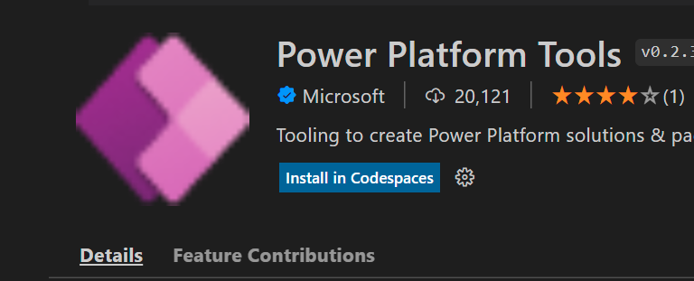

or you will see the following in your native VS Code instance.

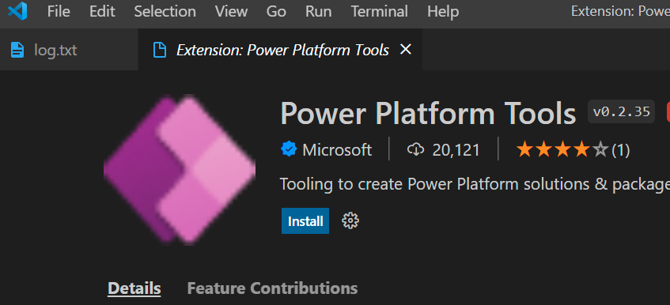

3.  Choose the **Install** button.

### Installing from Visual Studio marketplace

To install the extension, follow these steps.

1\) Navigate your browser to the following URL: <https://marketplace.visualstudio.com/>

2\) Select the **Visual Studio Code** tab, search for Power Platform, and select the extension as shown below

This will take you to the extensions page and from there you can launch the installation in your local instance of VS Code.

3\) Select **Install**

### Side load install of the extension

In some organizations, running an installation process directly off the web is prohibited. In most cases the organization downloads the installation in a secure location, tests it to make sure it does not violate company policy, and then makes it available to the rest of the organization. To do this, from the marketplace site for the extension and instead of pressing the **Install** button, select the **Download extension** link from the page.

This will download a VSIX file onto your workstation. On a PC, it downloads the file to the default download folder.

Once that file is downloaded, launch Visual Studio Code on your workstation.

1.  Select the **Extensions** icon from the **Activity bar**

2.  Click on the ellipsis … icon on the **Extensions** side bar

3.  Select **Install from VSIX**

This will now install the Power Platform extension in your Visual Studio Code or GitHub Extension. On the bottom right-hand corner, you will see the following message.

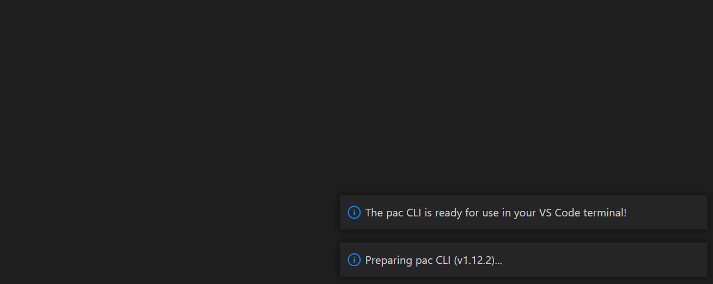

Once the installation is done, launch the terminal interface from the Visual Studio Code interface

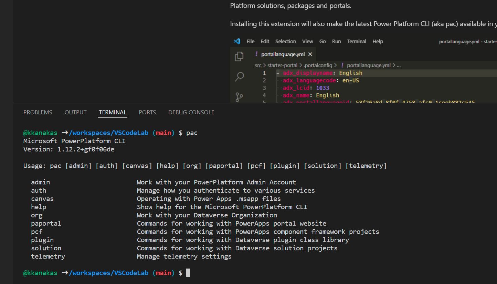

and you will see the following icon show-up on the activity panel.

## Authenticatng to power Platform and listing environments and solutions

When you click on the Power Platform icon on the **Activity bar** within the side bar, you will see two panels. These panels are called:

-   Authentication Profiles Panel

-   Environments and Solution Panel

The authentication panel will only list the Dataverse environments to which you are connected, and based on that connection, it will populate the environment and solutions to which you have access to.

If you don't have any authentication profiles listed, you will see the following on Codespaces.

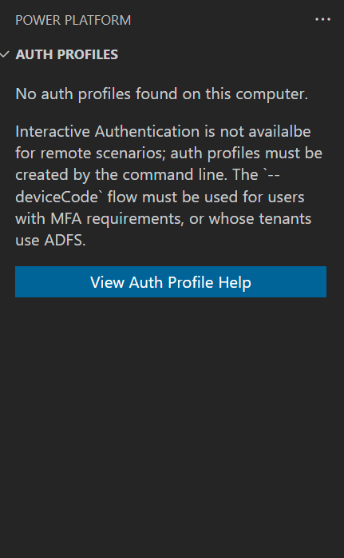.

If you select **Add Dataverse Auth Profile**, the terminal window opens and shows how to create the authentication profile using Power Platform CLI. The CLI command in this case is "pac auth create".

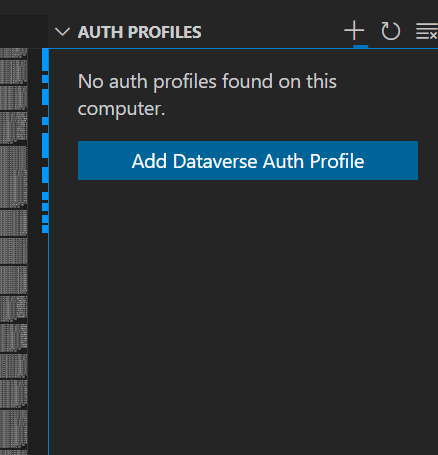

The "pac auth create" command enables you to create two kinds of connection profiles.

1.  Administrator – used to create, list, backup, and remove environments

2.  Dataverse – authenticated to the relevant environment to execute solution operations

In the Visual Studio Code extension, we focus on the latter.

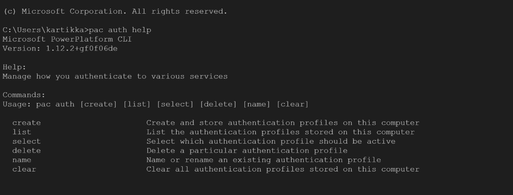

The CLI command to create an authentication profile is "pac auth create". This command by default creates a Dataverse authentication profile unless you specify admin as part of the --kind or -k parameter.

You can specify username and password for the connection with the --username or –password parameters, but these are optional. If you don't specify these parameters, the AAD authentication window pops up. You can also authenticate using service principal credentials, as in using your client ID and secret. You also have the option to use the device code authentication flow if you don't want to show your username and password when you are doing this lab. In this example, we are using the device code authentication flow.

To start the authentication flow, follow these steps.

1.  Launch a browser session and navigate to the URL <https://microsoft.com/devicelogin>

2.  Provide the device code.

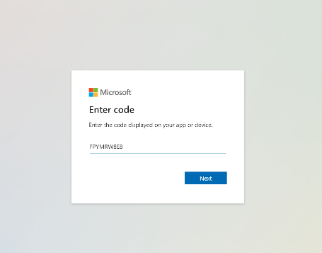

3.  Proceed to provide the name of the account you want to authenticate with Azure AD credentials.

The authentication profile token gets updated, and the authentication profile side bar shows the authenticated profile with a star against it.

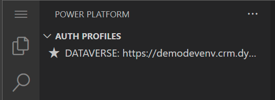

In the environments and solution section you will see the solutions that are available in the environment to which you are authenticated.

You have now authenticated Power Platform in the Visual Studio Code interface. When you right-click on a solution you have the following options to select from.

-   Copy the friendly name of the solution

-   Copy the unique name (this is the important one, for command operations)

-   Copy the version number of the solution

If you right-click on your authentication profile, you will see the following options.

-   Copying username used to authenticate with Power Platform

-   Name/Rename the authentication profile to a friendly name

-   Open a new tab and navigate to the environment URL

If you want to delete the profile you can press the trash icon, and that will delete your authentication profile.

If you have multiple authentication profiles, you can select the star icon of the profile that you want to change to, and that will be the profile that will be in effect.

This makes it easier to navigate across different authentication profiles. To create a second authentication profile, just repeat the same steps that you did to create the first one.

## Working with the Power Platform tools extension for Visual Studio Code

Now that we have installed the extension and authenticated to the environment, we are going to work with solutions using the Visual Studio Code user interface.

1.  Download the compressed .zip files that you need for this project from the [GitHub repository](https://github.com/microsoft/powerplatform-vscode-lab). This compressed zip file contains a solution and a PCF control that we are going to use for this project.

2.  In your GitHub repository upload the extracted contents of the zip file. The ability to upload files is under the **Add file** button. This will give you the option to drag files from your workstation and commit them to GitHub.

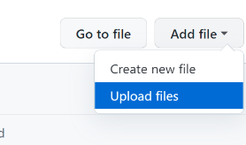

Your personal GitHub repository should look like the following:

If you are using Visual Studio Code locally on your workstation, then proceed to clone your repository on to your workstation.

1.  Under the **Code** button select **Clone** and copy the link to your repository.

2.  In Visual Studio Code select **Git** from the **Activity bar**, press the **Clone Repository** button in the side bar, and then paste the copied URL in the command palette. If you have not authenticated with GitHub, Visual Studio Code will prompt for your GitHub credentials. After providing the credentials, you will be able to clone your repository.

Now that your repository has been successfully cloned, let us start working with the solutions and controls. **Note: If you are using GitHub Codespaces, you do not have to authenticate with GitHub as you are already authenticated. All you must do is launch Codespaces from the Code button.**

### Working with controls and Solutions

Now that we are in our Visual Studio Code environment, let's install the required libraries and build the component.

To install the required libraries, follow these steps.

1.  Select the **Explorer** icon in the **Activity bar**. Your side bar should look like the following figure with the folders completely expanded.

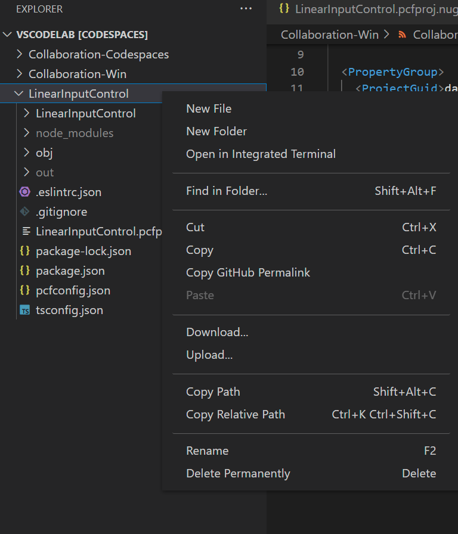

2.  Right-click on the **LinearInputControl** folder and select **Open in integrated terminal**.

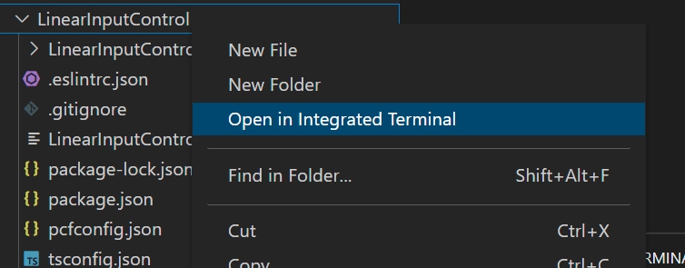

3.  In the terminal window, type the following:

This will install the appropriate node libraries needed for your PCF control. If there are things that need to be fixed, run "npm audit fix" to fix any vulnerabilities.

Once you have completed the above-mentioned operations, let's view the control and proceed to build it.

1.  Select the **Explorer** icon and expand the LinerInputControl folder contained within the LinearInputControl folder.

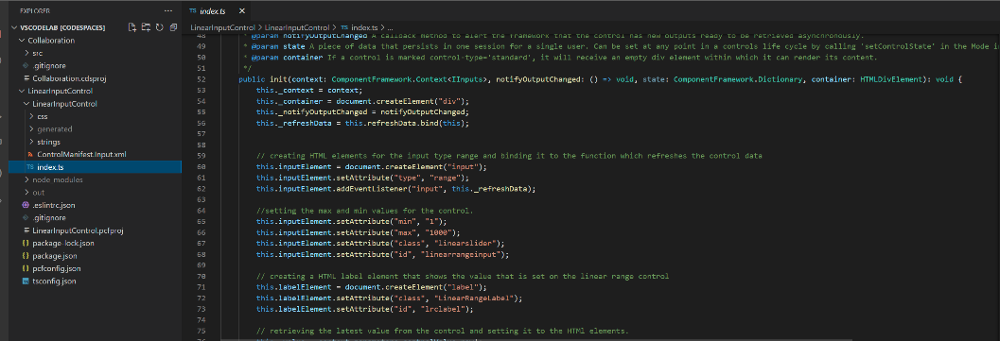

2.  Select the index.ts file and you can see that this is a slider control. Now when we proceed to build the control, the build will take these Typescript files and create the appropriate JavaScript for the web control.

3.  In the terminal window, type npm run build. You should see the following:

4.  Test the control by using the command npm run start. This command will launch the web control in a browser under the component framework testing environment.

5.  Slide the control back and forth and see the values change in the Data Input section.

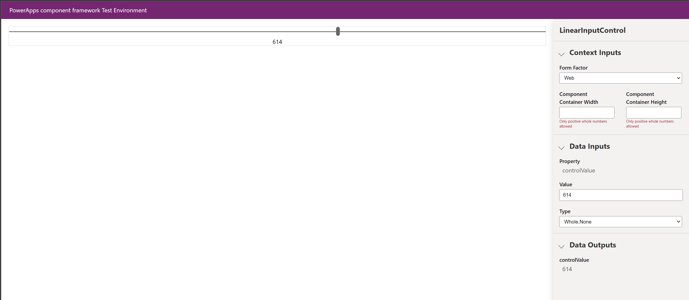

Now that we know our control works properly, let go ahead and add it to our solution.

1.  On the **Explorer** window, select the collaboration folder, and then right-click and select **Open in integrated terminal.**

2.  In the integrated terminal, type the "pac solution add-reference --path &lt;path to the pcf control&gt;". This will add the PCF control to the solution.

3.  Now proceed to build the solution by typing "dotnet build". This will start building the compressed zip file needed to import into your Power Platform environment.

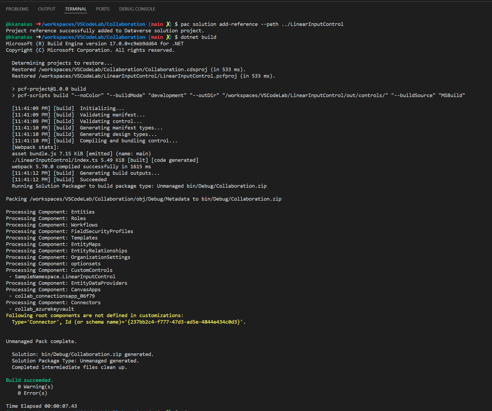

4.  Once the project is built, navigate to the bin\\Debug folder under the Collaboration folder. Run the following solution import command to import the solution back into our dev environment.

5.  Confirm that the solution has updated in your environment using the Power Platform web interface.

You have now successfully used the Visual Studio Code extension for Power Platform. This completes the lab.
